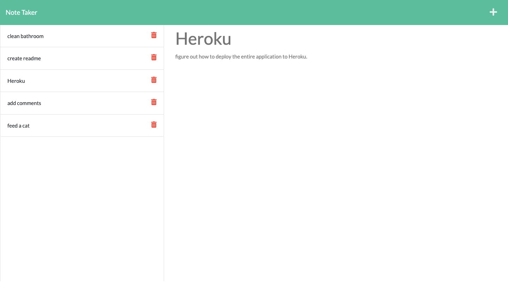

# green-scribbles

## Description

Github link
https://github.com/itcreativeusa/green-scribbles

Youtube video guide
https://youtu.be/-Cf7D6irPfY

This is a Note Taker that can be used to write and save notes. Application uses an Express.js back end and saves and retrieves note data from a JSON file.

## Table of Contents 

- [Installation](#installation)
- [Usage](#usage)
- [Requirements](#requirements)
- [Credits](#credits)
- [License](#license)

## Installation

This applicartion must be installed on computer. Open your computer’s command prompt (Windows) or terminal (macOS/Linux) and run the application
 
## Requirements

No special requirements

## Usage

Open the Note Taker and click to the notes page. Enter a new note title and the note’s text.
Save icon appears in the navigation at the top of the page
Click on the Save icon to save your note. To view existing note - click on an existing note in the list in the left-hand column. To create a new note - click on the Add icon in the navigation at the top of the page.
 
Screenshot located in `./public/assets/img/` folder

## Credits
 
Some code in file `component.js` was taken from Mini-Project provided by Berkeley Bootcamp for studying purposes.

## License

Please refer to the LICENSE in the repo.